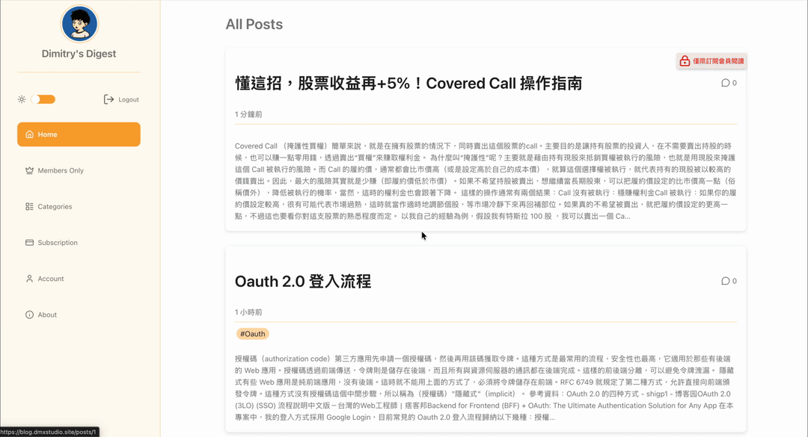
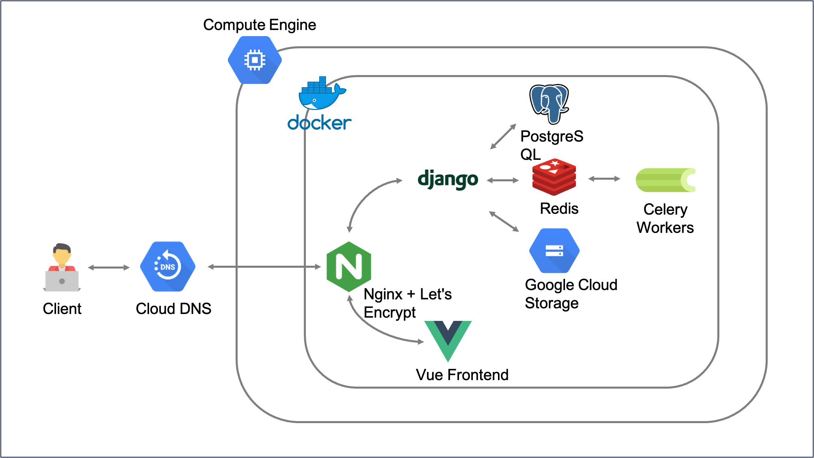

# MySubBlog – Personal Subscription-Based Blog

## Overview
A subscription-based personal blog where readers can access premium content via credit card (Paddle) or cryptocurrency (NOWPayments).  
This is a full-stack, frontend-backend separated project.

### Live Demo:



website link: https://blog.dmxstudio.site/  
### Demo Account:
- **Test Account:** test2@gmail.com / test123456  
- **Payment Disabled:** Payment buttons are hidden; no real transactions.  
- **Demo Data Only:** Changes do not affect production data.    


## Why I Built This
- Full ownership of content, user data, and revenue — no reliance on Medium, Substack, or or any other paltforms.  
- Real-world practice integrating multiple payment providers (fiat + crypto)  
- End-to-end full-stack experience: from infrastructure to UX  

## Key Features

### For Readers
- One-click Google OAuth login  
- Subscribe with credit card (Paddle) or 50+ cryptocurrencies (NOWPayments)  
- Instant access to all premium articles upon successful payment  
- Nested comment system with reply threads
- Automatic email notification when new articles are published  
- Fully responsive design + system-aware dark mode  
- Article categories, tags classification

### For Content Creator (Admin)
- Rich text editor (CKEditor 5) with direct image upload to Google Cloud Storage   
- Subscriber dashboard (integration with Paddle): active/canceled/expired users, revenue stats  

### System & Engineering Highlights
- Paddle & NOWPayments webhook handling with idempotency and retry logic  
- Background synchronization and email delivery via Celery + Redis  
- Deployment with Docker Compose + Nginx reverse proxy  
- Automatic Let's Encrypt SSL renewal (acme-companion)  
- Media served from GCS   
- Complete API-first architecture (Vue 3 frontend consumes Django REST API)

### Payment Gateway Integration Notes

While this project currently supports cryptocurrency subscriptions via NOWPayments, 
the platform's webhook system(IPN) only provides **payment events** and does not include 
**subscription lifecycle updates** (e.g., renewal status, expiration, or cancellation).

Because of this limitation, the backend includes a scheduled task (via Django-crontab) 
that periodically polls the NOWPayments API to verify the latest subscription statuses 
and ensure they are still marked as "paid."

This implementation works for the demo and prototype stage, but is not ideal 
for long-term production use. I plan to continue evaluating alternative payment 
providers that offer complete subscription webhook support.


## System Architecture
- Docker Compose deployment to GCP VM with Cloud DNS for domain management
- Google Cloud Storage (GCS) for media files
- Celery for synchronizing Paddle user data and sending emails
- Nginx reverse proxy with acme-companion for automatic SSL updates
- Frontend-backend separation: Vue frontend with Django REST API backend. 


## Technology Stack

| Layer          | Technologies                                                                                             |
|----------------|----------------------------------------------------------------------------------------------------------|
| **Frontend**   | Vue 3, Vite, Pinia, Vue Router, Axios, prismjs                                           |
| **Backend**    | Django 5, Django REST Framework, Django-Allauth, taggit                                |
| **Database**   | PostgreSQL 16                                                                                   |
| **Task Queue** | Celery + Redis Broker + Celery Beat                                                                      |
| **Payment Gateways**   | Paddle, NOWPayments |
| **Infrastructure** | Docker Compose, Nginx, acme-companion (auto Let's Encrypt SSL)<br>GCP Compute Engine VM, Cloud DNS, Cloud Storage |


## Setup

### Requirements
- Docker & Docker Compose
- PostgreSQL
- Redis
- Python 3.11
- Google auth client id and secret key
- GCS busket json file
- Paddle account & api keys
- Nowpayment account & api keys


### 1. Clone the repository:

```bash
git clone https://github.com/DimitryW/mySubBlog.git
cd mySubBlog
```

### 2. Set up environment variables in a .env file and place it in root directory(see example below).

```env
# Website settings
WEBSITE_TITLE="MySubBlog"
FRONTEND_URL=https://yourdomain.com
ALLOWED_HOSTS=yourdomain.com
CORS_ALLOWED_ORIGINS=https://yourdomain.com
CSRF_TRUSTED_ORIGINS=https://yourdomain.com
DOMAIN=yourdomain.com
ADMIN_EMAIL=youremail@example.com

# Django settings
DEBUG=True
SECRET_KEY='your-django-secret-key'

# Celery / Redis
CELERY_BROKER_URL=redis://redis:6379/0
CELERY_RESULT_BACKEND=redis://redis:6379/1

# PostgreSQL configuration
POSTGRES_DB=blog_project
POSTGRES_USER=blog_user
POSTGRES_PASSWORD=your-db-password
POSTGRES_HOST=db
POSTGRES_PORT=5432

# Google Cloud Storage
GOOGLE_EMAIL_USER=youremail@example.com
GOOGLE_EMAIL_PASSWORD=your-email-password
GOOGLE_APPLICATION_CREDENTIALS=./path_to_your/gcs_key.json
GS_BUCKET_NAME=your-gcs-bucket-name

# Paddle (Credit Card Payment)
PADDLE_SANDBOX=True
PADDLE_API_URL=https://api.paddle.com
PADDLE_SANDBOX_API_URL=https://sandbox-api.paddle.com
PADDLE_SECRET_KEY=your-paddle-secret-key
PADDLE_API_KEY=your-paddle-api-key

# NowPayments (Cryptocurrency Payment)
NOWPAYMENT_API_KEY=your-nowpayments-api-key
NOWPAYMENT_EMAIL=youremail@example.com
NOWPAYMENT_PASSWORD=your-nowpayments-password
NOWPAYMENT_IPN_SECRET=your-nowpayments-ipn-secret
```

### 3. Build and start the containers:

```
docker-compose up -d --build
```

### 4. Create a superuser:

```
docker-compose exec web python manage.py createsuperuser
```

### 5. Socialaccount settings:
Login to the admin interface to edit the socialaccount info with google auth client id and key for the allauth process.

 

## License

This project is licensed under the MIT License.  
Owner: Dimitry Wu
